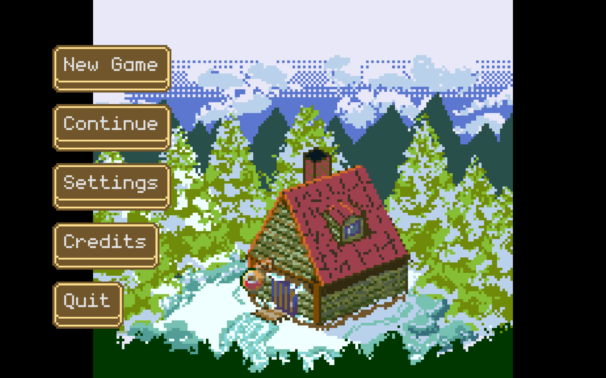
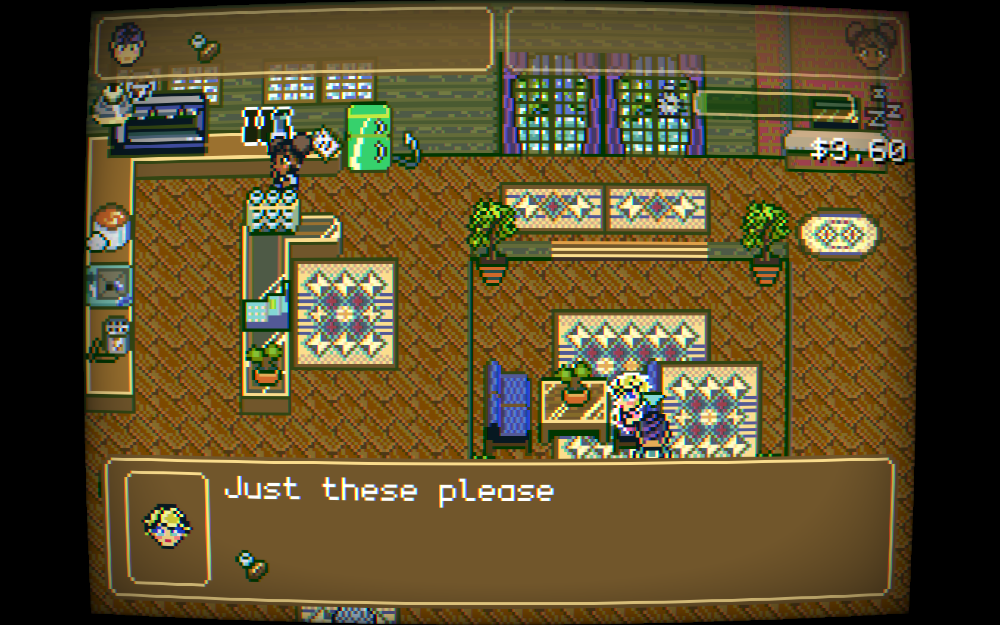
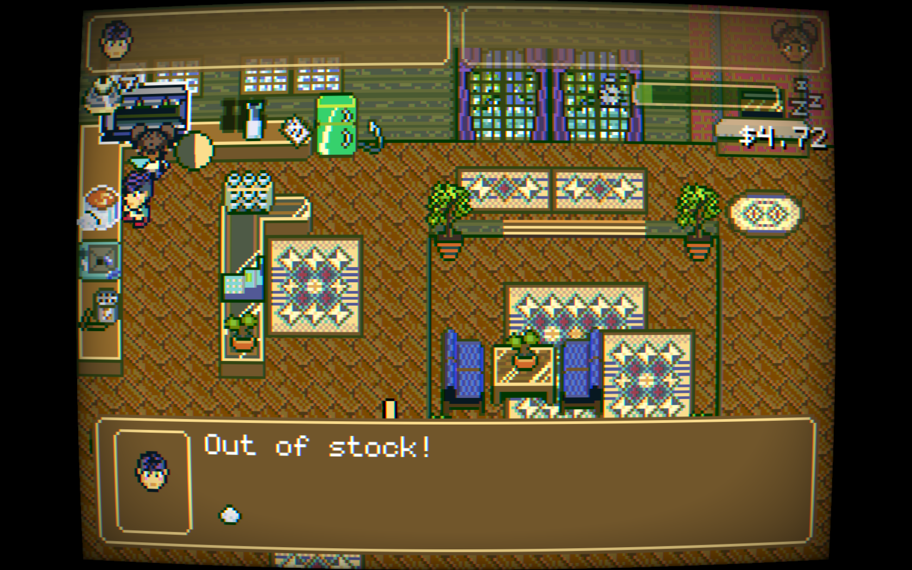

# Mocha Cabin #

A [Godot Wild Jam #40](https://itch.io/jam/godot-wild-jam-40) submission. This is a resource and time management sim, where the player takes control of two characters, and needs to run a coffee shop. Download or play on [itch](https://dmitriy-shmilo.itch.io/gwj40).

    
    
    

# Credits #

## Font ##

- [monogram](https://datagoblin.itch.io/monogram) by datagoblin

## Music ##

- [Jonpon](https://music.jonherbst.dev/)

## Art ##

- [Gabriel 'Adamastor' Da Mota](https://twitter.com/gabriel_damota)

## Code ##

- [Dmitriy Shmilo](https://dmitriy-shmilo.itch.io/)
